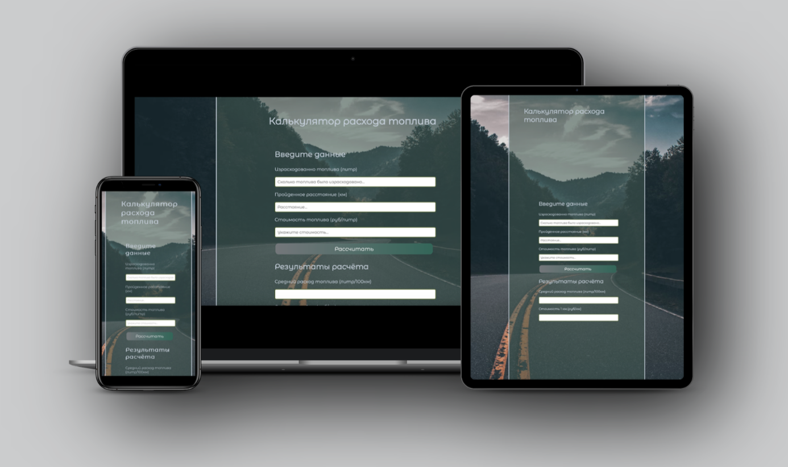
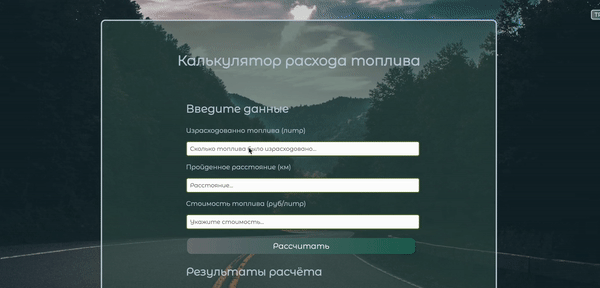

<h1 style="color: navy; background-color: #D4E2D4;" align="center">Hi there, I'm <a href="https://irina-narin-portfolio.glitch.me/" target="_blank">Irina</a> 
 <br>I am a student. Now I am learning <span style="color: red;">React</span></h1>


## ___<span style="color:#0B666A;">Fuel consuption App</span>___
---




_This project was created using <span style="color:red">HTML, CSS, JavaScript</span> ._
___
### **Project Overview**
The Fuel Consumption app is a simple calculator that calculates the fuel consumption of vehicles.
___

___Below you can see how the app works:___


___

```
This project was created for educational purposes.
```
